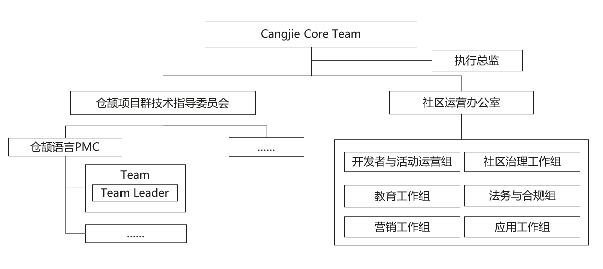

# 仓颉项目群开源治理制度
# 1 第一章 总则
## 1.1 第一条 项目群名称
仓颉项目群系由Cangjie Core Team孵化及运营的开源项目群。

仓颉项目群，全称为仓颉编程语言项目群，又称为仓颉开源社区，是一个面向应用开发的新一代编程语言的开源社区，简称仓颉或者仓颉社区，以下称“本项目群”。

## 1.2 第二条 项目群愿景
愿景：打造一款全场景面向应用开发的新一代编程语言，主要应用于鸿蒙原生应用和服务应用开发等场景，在全世界范围内被广泛使用。

## 1.3 第三条 项目群治理原则
以本项目群治理组织领导下的项目自治为原则，在遵守中华人民共和国法律法规的前提下进行开放治理和运营。

## 1.4 第四条 业务范围
1、探索和构建应用编程语言软件开源生态，促进面向数字基础设施的基础软件产业发展；

2、促进本项目群范围内的开源软件推广、使用、宣传、培训等；

3、提升本项目群的技术易用性和可靠性；

4、开展开源软件生态建设、宣传推广、学术交流、教育培训等相关活动；

5、开展与其他开源项目、社区的合作；

6、本项目群 IT 基础设施开发和运维。

## 1.5 第五条 社区行为准则
1、本行为准则是为了促进一个开放、包容、尊重和安全的环境，鼓励所有成员积极参与和贡献。本项目群致力于为所有人提供一个无骚扰的交流和合作空间，不论年龄、体型、身体健全与否、民族、经验水平、受教育程度、社会地位、国籍、相貌、种族、技术背景或职业。

本行为准则适用于所有本项目群成员，包括但不限于项目维护者、贡献者、用户和支持者。本准则适用于所有社区活动，包括但不限于在线讨论、会议、社交媒体互动和项目贡献。

2、有助于创造积极社区环境的行为包括但不限于：

(1)措辞友好且包容；

(2)尊重不同的观点和经验；

(3)耐心接受有益批评；

(4)与社区其他成员友善相处。

3、本项目群和社区的参与者不应采取的行为包括但不限于：

(1)发布与色情、暴力等有关的言论或图像；

(2)捣乱/煽动/造谣行为、侮辱/贬损的评论、人身及政治攻击；

(3)公开或私下骚扰本项目群和社区的其他参与者；

(4)未经明确授权发布他人的个人信息等资料，如住址、电子邮箱等；

(5)其他有理由认定为违反社区行为准则的不当行为。

4、社区项目维护者(Team Leader)有权利和义务诠释何谓“不当行为”，并妥善公正地纠正已发生的不当行为。社区项目维护者有权利和义务删除、编辑、拒绝违背本行为准则的评论（comments）、提交（commits）、代码、wiki 编辑、问题（issues）等任何贡献；社区项目维护者可暂时或永久地封禁任何其认为有威胁、冒犯、有害社区秩序的不当行为参与者。

5、本行为准则适用于本项目群。当有人代表本项目群时，亦应遵守本行为准则。

6、代表本社区的情形包括但不限于：

本人或授意他人：

(1)使用本社区的官方电子邮件；

(2)通过本社区官方媒体账号发布消息；

(3)作为本社区指定代表参与在线或线下活动等。

7、本项目群的行为准则可由Cangjie Core Team进一步定义和解释，并审批发布。

# 第二章 项目群成员
## 2.1 第六条 项目群成员的构成
1、项目群共建方：经 Cangjie Core Team 认可的参与本项目群开放治理的自然人或法人。

2、其他组织和个人：注册仓颉社区并使用社区资源，签署本项目群贡献者许可协议并参与本项目群贡献和社区建设但尚未成为项目共建方的广大自然人或法人，包括参与本项目群贡献但尚未成为项目群共建方的学术结构和非营利组织。

# 第三章 项目群治理架构
## 3.1 第七条 治理架构概况
本项目群治理组织中， Cangjie Core Team为本项目群的最高决策机构。

Cangjie Core Team设Cangjie Core Team主席和执行主席各一名，Cangjie Core Team主席和执行主席系Cangjie Core Team委员之一，负责指导Cangjie Core Team决策的执行，Cangjie Core Team主席为本项目群的主要负责人。

Cangjie Core Team设执行总监一名，负责本项目群日常工作的执行。

Cangjie Core Team设项目群技术指导委员会，是本项目群的技术和项目管理领导机构。技术指导委员会独立审核准入开源项目（简称项目），在合法合规并严格遵循本项目群相关制度规定的前提下开展工作。

本项目群组织架构如下图：

## 3.2 第八条 Cangjie Core Team
1、Cangjie Core Team委员组成

Cangjie Core Team是本项目群所有业务决策的最高决策机构，对包括但不限于制定及修改本项目群开源治理制度、决定重大业务活动计划、制定及调整项目群的重大方向、决定项目群的中止或终止、审定年度收支预算及决算及年度财务审计报告。Cangjie Core Team由项目群共建方委派的代表及Cangjie Core Team邀请的自然人共同组成，负责处理Cangjie Core Team日常事务并对本项目群进行开放治理。Cangjie Core Team的成员个人及其委派单位对Cangjie Core Team做出的业务决策承担责任。Cangjie Core Team委员应具备以下条件：

(1)具有完全民事行为能力；

(2)遵守法律法规；

(3)热心开源事业，自愿为本项目服务；

(4)具有较强的责任意识，能够遵循公平、公正、公开的原则，独立、客观、谨慎地参与议事决策；

(5)能够为本项目群筹划、捐款、管理做出贡献；

(6)相关法律法规要求需满足的其他条件。

2、Cangjie Core Team委员任职规则

原则上，所有Cangjie Core Team委员应任职至其继任人被任命或选出为止。但因离职等其他特殊原因的除外。Cangjie Core Team委员每届任期为两年，可连选连任。

3、Cangjie Core Team委员的管理

(1) Cangjie Core Team委员加入：首届由仓颉项目设立方选举并委派十一名代表参加Cangjie Core Team。后续委员由现任Cangjie Core Team推荐，经Cangjie Core Team全体委员三分之二以上（含）表决通过后加入。

(2) Cangjie Core Team委员退出：共建方委派的代表离职或因其他原因需更换的，共建方可以撤销原代表委派并重新委派代表。Cangjie Core Team委员向本Cangjie Core Team全体成员提交书面通知，可以退出Cangjie Core Team；Cangjie Core Team委员连续两次无故不出席Cangjie Core Team会议的，视为自动退出Cangjie Core Team；Cangjie Core Team接受委员缺位。

(3) Cangjie Core Team委员的罢免： 由Cangjie Core Team委员三分之一以上（含）发起，Cangjie Core Team全体委员三分之二以上（含）通过后罢免。

4、Cangjie Core Team职责和权利包括但不限于：

(1)制定、修改本项目群开源治理制度，由Cangjie Core Team制定和审定的项目群管理制度是本项目群开放治理基本纲领；

(2)决定重大业务活动计划，包括项目群资金筹集、财产管理和使用计划、项目群年度活动计划等；

(3)制定及调整项目群的重大方向，项目群的中止或终止；

(4)审定项目群年度收支预算及决算、年度财务审计报告；

(5)决定项目群的知识产权授权管理，包括项目名称及品牌等；

(6)决定聘选和任免Cangjie Core Team委员，并完成向上报备；

(7)选举Cangjie Core Team主席，并完成向上报备；

(8)选举Cangjie Core Team执行总监，并完成向上报备；按需聘用全职工作人员；

(9)听取、审议Cangjie Core Team执行总监的工作报告，检查执行总监的工作；

(10)审议项目群各下设组织的主席的选举和罢免；

(11)审议各下设组织的工作报告和问题；

(12) Cangjie Core Team可进一步根据工作需要，经合法流程授权相关委员会、工作组和/或具体人员承担相应业务职责;

5、Cangjie Core Team会议发起及召集方式

Cangjie Core Team会议每年举行两次例行会议，或者依据项目群情况召开临时会议。

(1)发起机制：Cangjie Core Team例会由Cangjie Core Team执行总监发起并主持。Cangjie Core Team临时会议由Cangjie Core Team主席依据项目群情况发起，或现有Cangjie Core Team委员三分之一以上（含）提议发起；

(2)召集方式：Cangjie Core Team会议由Cangjie Core Team执行总监或召集人在会议召开前 5 个工作日通过邮件通知全体委员；

(3) Cangjie Core Team会议须有现有Cangjie Core Team委员（含委托）三分之二以上（含）出席为有效会议；

(4)不出席会议也没有委托他人代理参会的Cangjie Core Team委员视为缺席，不计入本次会议投票；

(5)与会形式包括现场与会、线上接入等可以核实身份的多种形式。

6、表决和投票
(1) Cangjie Core Team每个委员享有一票投票权。Cangjie Core Team召开会议决策事项至少需由Cangjie Core Team委员半数以上（含）投票通过。为免疑义，若Cangjie Core Team委员同时担任Cangjie Core Team主席或执行主席的，则该委员共计享有一票投票权。

(2)投票分为赞同、反对和弃权，投票模式为公开记名投票。

(3) Cangjie Core Team委员委托他人代理参会的，该被委托人不得参与本次会议投票表决，投票表决仍应由委托人表决。

(4)如果需要，Cangjie Core Team会议决策也可以采用在线投票的方式进行，在投票启动后 5 个工作日内为投票时间，超过投票时间没有投票的记为弃权，投赞同票的委员需要超过Cangjie Core Team委员数量的半数方为投票通过；如果在投票启动后 5 个工作日内参与投票的委员没有超过半数的，则需要重新发起投票。

(5)以下事项需Cangjie Core Team全体委员三分之二（含）以上投票通过方为有效：

a.制定、修改本项目群治理制度；

b.项目群中止、项目群重大方向的制定与调整及项目群终止；

c. Cangjie Core Team执行总监的选举；

d.审批各下设机构成员的任命和罢免；

e.决定重大业务活动计划，包括项目群资金筹集、管理和使用计划、品牌授权管理制度、项目群年度活动计划。

## 3.3 第九条 Cangjie Core Team主席
1、Cangjie Core Team设主席一名。Cangjie Core Team主席作为Cangjie Core Team委员， 由Cangjie Core Team从Cangjie Core Team委员中选举产生，在Cangjie Core Team各享有投票权。Cangjie Core Team主席每届任期 2 年，可以连选连任。

2、Cangjie Core Team主席行使下列职权：

(1)在Cangjie Core Team会议上检查Cangjie Core Team决议的落实情况；

(2)提议聘任或解聘本项目群下法务、财务等相关专门人员或相关负责人。

## 3.4 第十条 Cangjie Core Team执行主席

1、工作委员会设执行主席一名。执行主席由主席从Cangjie Core Team委员中提名，或经主席认可由Cangjie Core Team委员选举产生。担任执行主席不影响该委员享有的提案权和投票权。Cangjie Core Team执行主席每届任期 2 年，可以连选连任。

2、工作委员会执行主席行使下列职权：

1） 经Cangjie Core Team会授权，在被授权范围内代表仓颉项目群出席活动；

2） 检查和监督Cangjie Core Team决议和各下设工作组的执行、落实情况；

3） 与执行总监协商后提议委任或罢免各工作组或委员会负责人，并提交Cangjie Core Team决策；

4） 可以指定助理协助其工作；

5） 本开源治理制度规定应由执行主席行使的其他权利。

## 3.5 第十一条 Cangjie Core Team执行总监

1、Cangjie Core Team设执行总监一名，由Cangjie Core Team提名，通过Cangjie Core Team表决后正式任命。Cangjie Core Team执行总监不属于Cangjie Core Team委员，在Cangjie Core Team不享有投票权。Cangjie Core Team执行总监每半年向Cangjie Core Team进行述职，并接受Cangjie Core Team考核。Cangjie Core Team执行总监每届任期 2 年，可以连选连任。

Cangjie Core Team各下设组织(特指第十四条款所述)不受Cangjie Core Team执行总监的领导，但其负责人需要向Cangjie Core Team执行总监定期交流同步相关工作内容。

2、Cangjie Core Team执行总监行使下列职权：

(1)开展项目群日常工作，组织实施Cangjie Core Team决议；

(2)组织社区制定年度规划，根据规划制定年度预算，向Cangjie Core Team汇报；

(3)组织实施经Cangjie Core Team同意后的项目群年度活动计划；

(4)支撑和监督社区各个组织机构完成既定年度任务；

(5)拟定资金的筹集、管理和使用计划；

(6)协调执行秘书、财务、法务等的日常工作；

(7)发展项目群成员，根据本治理制度的规定支撑资格注册等流程，并协助规划成员公司在本项目群发展路径，辅导其融入社区；

(8)依据仓颉项目群品牌授权管理制度的规定，履行品牌授权管理职责；

(9)审计社区各个机构和人员的日常工作，对于审计到违反本治理制度或国家法律法规的问题，应提交到Cangjie Core Team处理；监督和审计社区资产和经费的使用，对于滥用、侵吞等违反本治理制度和国家法律法规的行为，应提交到Cangjie Core Team处理；

(10)代表项目群和其他开源组织或业务相关组织机构进行业务交流，制订合作方案并执行；

(11)发展和协同全球的面向国家、城市、行业等维度的发展组织，帮助其与项目群各部门协同，开展生态发展活动；

(12)收集项目群成员和开发者的满意度意见，向Cangjie Core Team及相关组织反馈，并监督投诉和反馈的处理结果；

(13)协调项目群内其他组织机构的运作执行，维护项目群的正常运作；

(14)Cangjie Core Team赋予执行总监的其他职权。

## 3.6 第十二条 Cangjie Core Team主席、执行主席、执行总监的任职条件

(1)具有完全民事行为能力；

(2)在项目群业务领域内有较大影响力；

(3)应当遵守法律法规和本项目群治理相关规定；

(4)热衷于从事开源工作，善于协调与沟通；

(5)Cangjie Core Team执行总监为专职，熟悉本项目群业务领域。

## 3.6 第十三条 Cangjie Core Team主席、执行主席、执行总监的退出和罢免

1、退出：如果需要在任期届满前卸任，需提前 30 个工作日通过邮件等书面方式通知Cangjie Core Team。新任Cangjie Core Team主席、执行主席、执行总监经重新选举产生。原主席、执行主席、执行总监的任期，从新主席、执行主席、执行总监选出之日起截止。原主席、执行主席、执行总监应配合做好交接工作。

2、罢免（出现以下任意一种情况即可）：

(1) Cangjie Core Team提出对Cangjie Core Team主席、执行主席、执行总监的罢免并通过Cangjie Core Team的罢免决议；

(2) 共建方提出对Cangjie Core Team主席、执行主席、执行总监的罢免。

## 3.8 第十四条 Cangjie Core Team下设组织

Cangjie Core Team下设各组织的负责人（各委员会、工作组主席）任命均由下设组织选举并由Cangjie Core Team正式任命。

### 3.8.1 技术指导委员会
Cangjie Core Team下设唯一的技术指导委员会。技术指导委员会是本项目群的技术和项目领导机构。技术指导委员会独立审核准入开源项目，在合法合规的前提下，依照该项目群开源治理制度开展工作。

技术指导委员会由下列人员组成：技术指导委员会主席一名，委员若干名，以及其他需要选举产生的委员若干名。

技术委员会主席任期为 2 年，可连选连任。技术委员会委员每届任期为 2 年，可连选连任。

(1)技术指导委员会委员产生

技术指导委员会需要选举产生的新委员由技术指导委员会选举人投票选举产生。技术指导委员会委员对本项目群技术方向和项目管理负责，受本项目群全体成员监督。

需通过选举产生的技术指导委员会委员候选人通过以下方式产生：

a.由技术指导委员会提名；

b.或自荐，需获得至少四名技术指导委员会现任委员书面推荐；

(2)技术指导委员会委员退出： 

技术指导委员会委员向本技术指导委员会全体成员提前三十个工作日提交书面通知，可以退出技术指导委员会；技术指导委员会委员连续两次无故不出席技术指导委员会会议的，视为自动退出技术指导委员会。

(3)技术指导委员会委员更换： 

主动申请退出的技术指导委员会委员在退出过程中，该技术指导委员会委员可提名新的技术指导委员会委员候选人；如果主动申请退出的技术指导委员会委员不提名新的技术指导委员会委员候选人，则可由技术指导委员会主席提名。新任技术指导委员会委员按照技术指导委员会投票决策机制进行决策，决策通过后更换生效。技术指导委员会主席可以根据仓颉项目群技术发展需要，新增技术指导委员会委员席位，按照技术指导委员会决策机制决策通过后生效。

(4)技术指导委员会会议和日常工作由技术指导委员会主席或其授权的委员组织。

(5)技术指导委员会下设项目管理委员会（PMC）

仓颉项目群下各项目有权设立各自的项目管理委员会。项目管理委员会主席的任命与罢免应报仓颉项目群技术指导委员会审批。项目管理委员会成员基于在项目中的技术和代码贡献选举产生。项目管理委员会的开源治理制度由各项目的项目管理委员会在不违反仓颉项目群开源治理制度的前提下自行制定，并经项目管理委员会审批通过后生效。
项目管理委员会职责包括但不限于版本管理：仓颉项目群版本规划采用项目自治原则，由各项目的项目管理委员会进行各自项目的规划。项目版本正式发布前需由仓颉项目群技术指导委员会进行审批。

(6)技术指导委员会的工作职责如下：

a.讨论决策项目群技术发展方向和愿景；

b.讨论和决策项目群的重大技术事项；

c.决策 PMC 的成立和撤销，审视和辅导 PMC 的日常工作，审视 PMC 的委员履职情况，协调 PMC 间技术合作；

d.决策项目的准入、成立和撤销；

e.落实社区日常开发工作，保证开源项目高质量发布；

f.协调社区其他组织结构的共性反馈并组织技术讨论，协调项目群技术发展和用户需求的关系；

g.孵化技术创新项目，构建项目群的技术影响力；

h.其他对社区有重要影响的技术工作；

i.讨论决策项目群项目的立项、版本规划、结项等重大版本管理事项。

(7)技术指导委员会工作方式

a.技术指导委员会的主要工作方式通过技术指导委员会会议，技术指导委员会每个日历年至少召开 6 次会议。具体例会频度和时间由技术指导委员会自行确定，所有技术事项在技术指导委员会会议中做出讨论和决策；

b.技术指导委员会会议公开召开；

c.技术指导委员会会议须有三分之二以上（含）技术指导委员会委员出席方能召开。当与会人数达不到前述法定人数时，按一般工作会议召开，但不得以技术指导委员会的名义形成决议； 有五分之一以上的技术指导委员会委员提议，可以临时召集技术指导委员会会议，技术指导委员会主席必须在收到临时召集提议的二十个工作日内召集会议；

d.技术指导委员会委员须按时参加技术指导委员会会议；

e.技术指导委员会会议纪要需要存档并可供公众公开访问。

(8)技术指导委员会决策机制

a.超过三分之二技术指导委员会委员与会的会议为有效会议；与会形式包括现场与会、线上接入等可以核实身份的多种形式；

b.不可委托他人代理参会并进行表决；

c.投票分为赞同、反对和弃权，投票模式为公开记名投票；

d.在会议上进行投票时，与会委员过半数投赞同票则通过决议；

e.如果需要，技术指导委员会会议决策也可以采用在线投票的方式进行，在投票启动后 5 个工作日内为投票时间，超过投票时间没有投票的记为弃权，投赞同票的委员需要超过技术指导委员会全体委员数量的半数方为投票通过；如果在投票启动后 5 个工作日内参与投票的委员没有超过半数的，则需要重新发起投票;

f.凡需要技术指导委员会决议的事宜，均需要在技术指导委员会会议上进行投票决策；

g.列席技术指导委员会的顾问，可发表意见，但无表决权。

(9)技术指导委员会主席管理

技术指导委员会主席的产生：技术指导委员会主席由技术指导委员会委员从技术指导委员会委员中投票选举，经 Cangjie Core Team 审议后任命。

技术指导委员会主席的退出：技术指导委员会主席如果需要在任期届满前卸任，需提前 30 个工作日通过邮件等书面方式通知 Cangjie Core Team 委员会执行总监，由执行总监负责协调重新选举技术指导委员会主席。

技术指导委员会主席的罢免：由技术指导委员会委员三分之一以上（含）发起，技术指导委员会全体委员三分之二以上（含）通过后罢免。

### 3.8.2 社区运营办公室

项目群的生态运营组织。项目群可以设置运营专职人员为项目群提供专业的开发者与活动运营、社区治理、教育拓展、营销工作、法务支持、应用拓展等支持。项目群运营专职人员经Cangjie Core Team同意后任命，在Cangjie Core Team执行总监的指导下开展工作，向Cangjie Core Team汇报。

### 3.8.3 委员会增设

Cangjie Core Team可以就项目群实际运行情况成立新的委员会，委员会的工作规则及人员任命由Cangjie Core Team决策。

# 第四章 项目群资产管理
## 4.1 第十五条 本项目群资金募集、财产管理和使用
1、本项目群财产来源：

(1)自然人、法人或其他组织自愿捐赠；

(2)共建方的项目经费；

(3)在业务范围内开展活动或提供服务所得；

(4)银行存款利息等合法孳息收入；

(5)其他合法收入。

2、本项目群财产主要用于：

(1)管理、运营本项目群，包括但不限于相关知识产权保护；

(2)开展开源推广、开源合规使用宣传、培训等；

(3)定期组织开展开源相关研讨活动；

(4)行政办公费用支出；

(5)IT 基础设施建设费用和运营费用；

(6)商标注册和维护费用；

(7)其他保障项目基本运营活动的必要费用；

(8)对志愿者、兼职人员的劳务支出等；

(9)对单位成员、友好社区、开源社区分支机构等经费；

(10)为项目群发展对其他机构的赞助费用；

(11)激励或者奖励金；

(12)聘用人员的薪酬福利；

(13)差旅及差旅补助费用；

(14)稽查、审计等费用；

(15)管理会议费用；

(16)其他必要费用。

3、本项目群财产及其他收入受法律保护，任何单位、个人不得侵占、私分、挪用。 捐赠人有权向本项目群查询捐赠财产的使用、管理情况，并提出意见和建议。对于捐赠人的查询，本项目群应当及时如实答复。

4、本项目群财务遵循国家相关财务管理制度，并接受审计监督。

5、终止：

本项目群有以下情形之一，应当终止：

(1)完成本项目群治理制度规定的愿景的；

(2)无法按照本项目开源治理制度的规定继续从事开源活动的。

## 4.2 第十六条 知识产权策略
1、本项目群的知识产权管理应符合中华人民共和国法律法规要求。

2、贡献到仓颉项目群的项目代码，原则上应以源代码形式提供，且应包含开源许可证。对不符合前述原则的贡献，应由对应的项目管理委员会决策是否接纳。

3、代码贡献者应按照仓颉项目群下各项目的要求签署对应的原创声明或者贡献协议。

4、仓颉项目群下对外许可的开源项目将以开源许可证发布，但经对应项目管理委员会另有决策的除外。

# 第五章 附则
## 5.1 第十七条 制订、修改及解释
本项目群治理制度的制订、修改及解释由Cangjie Core Team负责。

## 5.2 第十八条 生效
本项目群治理制度经Cangjie Core Team投票通过并发布后生效。
