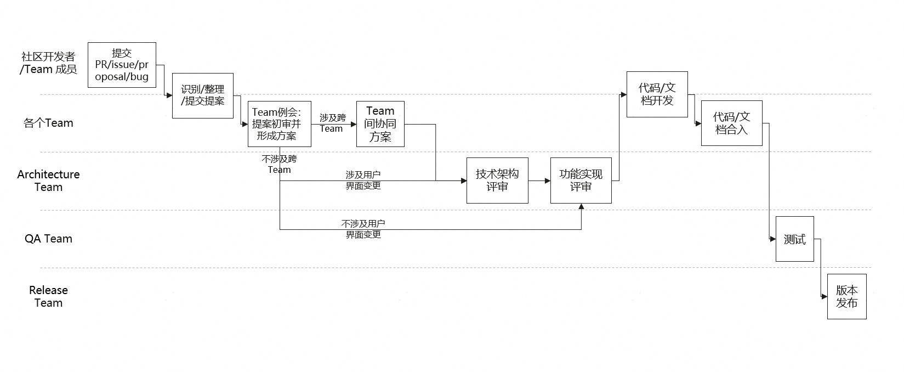
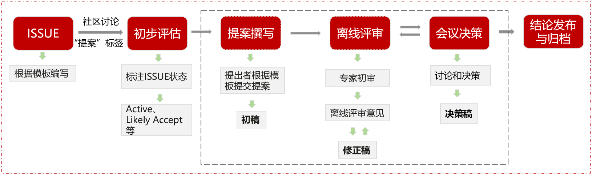

# 仓颉社区提案管理

仓颉编程语言是一款面向全场景智能的新一代编程语言，主打原生智能化、天生全场景、高性能、强安全。主要应用于鸿蒙原生应用及服务应用等场景中，为开发者提供良好的编程体验。本文概述了仓颉社区提案和语言演进过程。

## 1. 范围

社区提案及语言演进范围涵盖仓颉语言、标准库及工具链相关设计和更改，包括对以下内容的添加、删除与修改：

- 仓颉编程语言设计（当前）
- 标准库API设计（后续）
- 编译器及工具链实现等（后续）

错误修复、优化或诊断改进等更改可以通过参与贡献过程进行贡献;请参阅[如何贡献](https://gitcode.com/Cangjie/CangjieCommunity/blob/main/contribute/contribution.md)。仓颉社区提案是否被接收取决于相关Team及PMC判断。

## 2. 流程

### 2.1 起始环节
社区开发者或Team成员提交PR/issue/proposal/bug，即合并请求、议题、提案或问题。
这是整个流程的起点，标志着新功能的提出或问题的发现。
### 2.2 提案整理环节
进入「识别/整理/提交提案」阶段，对提交的内容进行初步整理和分类。
该阶段的目的是确保提案清晰、完整，便于后续的评审和处理。

#### 2.2.1 社区讨论

社区成员及相关Team团队成员在ISSUE中进行讨论。

#### 2.2.2 初步评估

语言设计 Team 根据社区讨论结果对ISSUE状态进行标注：包括“Active”、“Likely Accept”、“Needs Decision”和“Likely Decline”。

- Active：提案正在ISSUE讨论中，将在指定日期范围内开展审核。
- Likely Accept：该提案有很高的概率被接收，具有该标签将被优先审查。
- Needs Decision：提案正在ISSUE讨论中，需要更多场景/信息/讨论。
- Likely Decline：该提案有很高的概率被拒绝，具有该标签将被优先审查。

#### 2.2.3 **提案撰写**

根据提案模板编写提案，通过邮件提交初稿至语言设计 Team。

#### 2.2.4 离线评审

由语言设计 Team 对接收到的初稿组织离线评审。团队成员根据初稿反馈离线评审意见，最终得到提案修正稿。获得修正稿后可提交提案评审会申报议题。

### 2.3 提案初审环节
- 进入各个Team的「Team例会：提案初审并形成方案」环节。
- 在此处会根据提案的性质分成两个分支：
  - **分支一：涉及跨Team**：若提案涉及多个团队的协作，则先输出「Team间协同方案」，明确各团队的职责和协作方式，再进入后续评审环节。
  - **分支二：不涉及跨Team**：若提案仅涉及单个团队，则直接进入后续评审环节。
### 2.4 评审环节
- 根据提案是否涉及用户界面变更，进入不同的评审路径：
  - **路径一：涉及用户界面变更**：先经过「技术架构评审」，确保技术方案的可行性和稳定性，再进入「功能实现评审」，对功能的具体实现进行评估。
  - **路径二：不涉及用户界面变更**：直接进入「功能实现评审」，对功能的实现进行详细审查。

- 由评审会组织人形成纪要，记录要点、讨论结果和决策事项，并发布到邮件列表，定期归档至开源代码仓。

### 2.5 开发与合入环节
- 评审通过后，进入「代码/文档开发」环节，开发人员根据评审意见进行代码编写和文档完善。
- 开发完成后，进行「代码/文档合入」，将开发好的代码和文档合并到项目主分支中。
### 2.6 测试与发布环节
- 代码文档合入后，进入「测试」环节，由QA Team对功能进行全面测试，确保功能的正确性和稳定性。
- 测试完成后，最终进行「版本发布」，由Release Team将新版本正式发布，完成整个流程。

### 3. 评审会议：

#### 3.1 频率：每月初（以邮件订阅通知为准）。

#### 3.2 会议内容：优先审查 “Active”、“Likely Accept”和 “Likely Decline” 的提案。

#### 3.3 参与人员：仓颉语言设计核心团队、相关开发团队成员。

#### 3.4 会议纪要：公开发布至开源代码仓。

### 4. 决策机制

讨论为主，当讨论无法得出结论时进行投票。

#### 4.1 **投票方式**：采用投票方式决策，需语言设计Team 2/3 以上成员同意方可通过。

#### 4.2 **投票权**：每个成员拥有一票投票权。

#### 4.3 **否决权**：语言设计Team Leader具备否决权，但在使用否决权时需向全体成员说明理由。

