## 一、 仓库配置与命名规范

### **1. 命名与基础设置**

- **命名准则**：版本主干仓库原则上采用 `cangjie_` 前缀，使用小写字母命名，单词间以底划线 `_` 分隔。例如：`cangjie_multiplatform_interop`。

- **默认分支**：开发分支（默认为 `main`）须设置为默认分支。

- **功能约束**：除经 PMC 评审备案的特殊用途外，代码仓原则上取消 Wiki 与安全漏洞反馈模块。文档应通过专门的资料仓管理，安全漏洞须通过官网邮件渠道反馈。

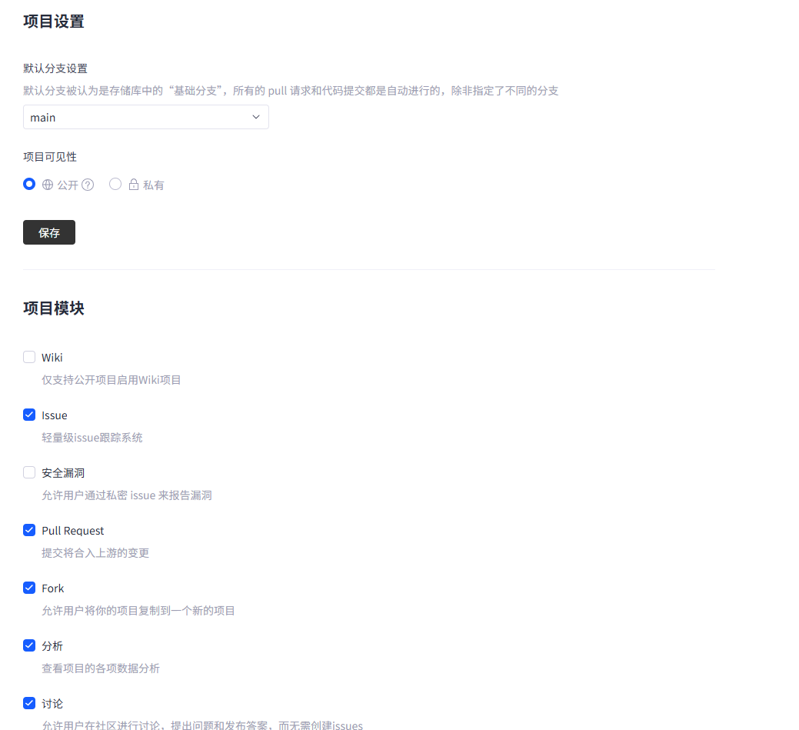

### **2.  分支与 Tag 管理**

- **工作流模式**：社区统一采取 Fork 开发工作流，原则上禁止开发者直接在主仓库创建分支。

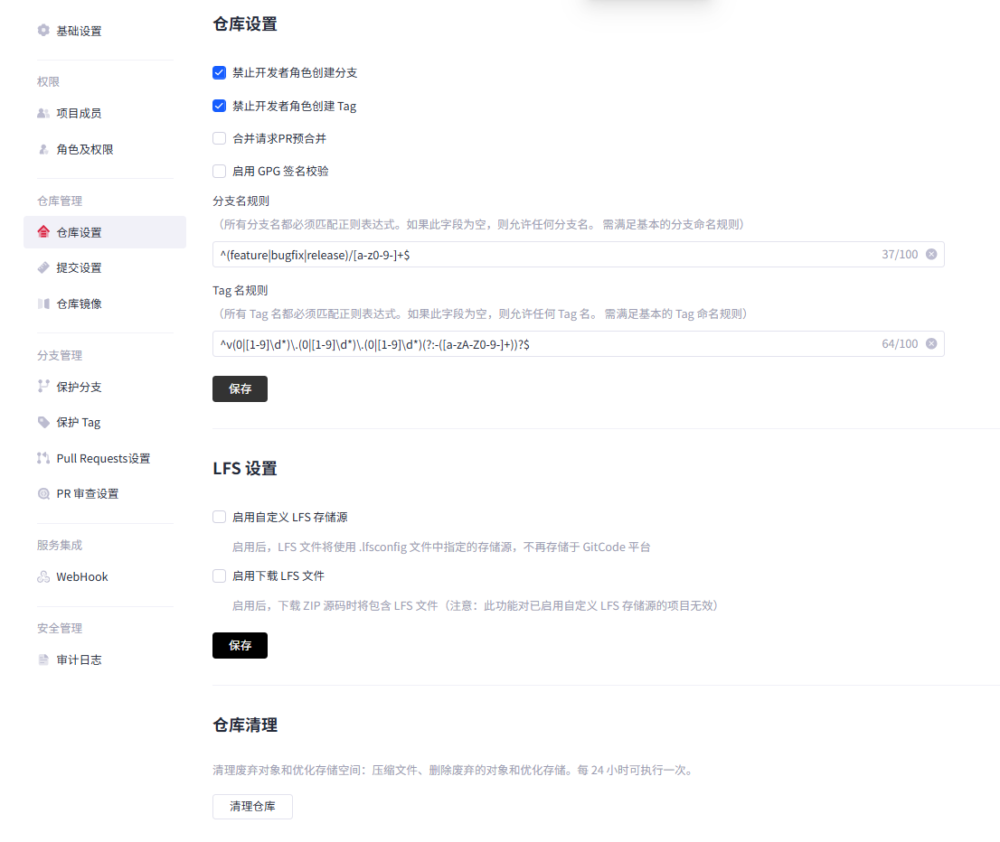

- **分支命名策略**：分支命名须具备明确语义，遵循以下正则表达式：`^(feature|bugfix|release)/[a-z0-9.-]+$`。
  - **发布分支**：以 `release/v<版本号>` 格式命名。
  - **特殊说明**：`dev`（开发）与 `main`（发布）分支不受上述命名正则限制。

- **Tag 命名规范**：Tag 须与社区版本号保持一致，遵循语义化版本规则：

  - 通用格式：`^v(0|[1-9]\d*)\.(0|[1-9]\d*)\.(0|[1-9]\d*)(?:-([a-zA-Z0-9-]+))?$`。格式为： v<主版本>.<次版本>.<修订版本>-先行版本号(可选)，示例： `V1.2.3-alpha`。

  - 扩展库（stdx）特例：`^v(0|[1-9]\d*)\.(0|[1-9]\d*)\.(0|[1-9]\d*).(0|[1-9]\d*)(?:-([a-zA-Z0-9-]+))?$`，其版本命名风格跟其他工程权限有所差异，采用四位版本号规则。

## 二、 开发协作与提交准则

### **1. 提交规范（Git Commit）**

- **日志标准**：推荐采用“约定式提交”（[Conventional Commits](https://www.conventionalcommits.org/zh-hans/v1.0.0/)）规范。提交信息须通过正则校验：`^(?<type>feat|fix|docs|style|refactor|test|chore|perf|build|ci|revert)(\((?<scope>[\w\-]+)\))?!?:\s(?<description>.{1,72})$`。

- **物理限制**：单文件提交体积上限为 100M。

- **操作禁令**：严禁执行强制推送（Force Push）操作。

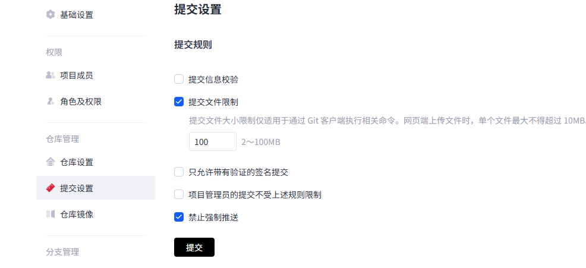

### **2.  权限控制**

代码仓核心角色分为 Developer 与 Committer。

- **Developer**：拥有基础的开发协作权限。

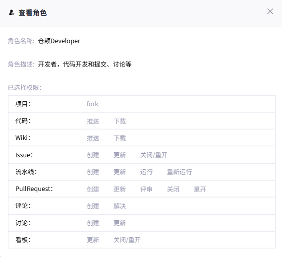

- **Committer**：拥有代码评审及合入控制权限。

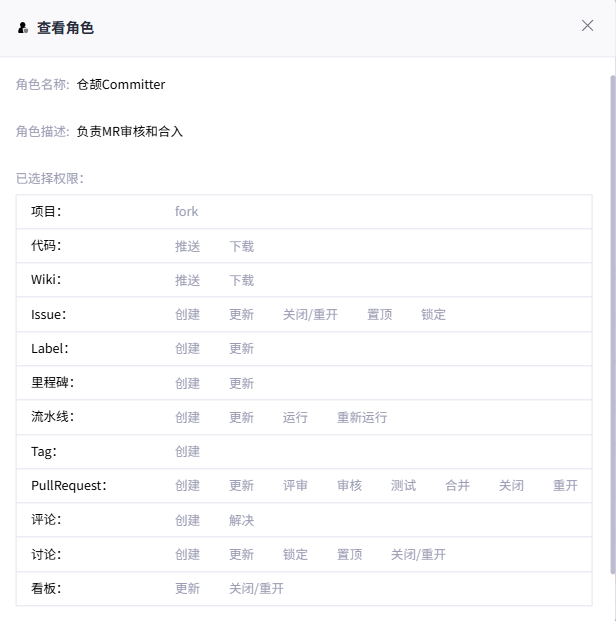

- **保护分支**：默认开发分支、发布分支及 LTS 版本分支须设置为保护分支。

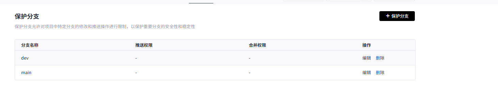

## 三、 合入请求（Pull Request）治理

### **1.  PR 合入条件**

- **多员检视**：每个 PR 至少须有两名评审人（Developer 或 Committer）评审通过。

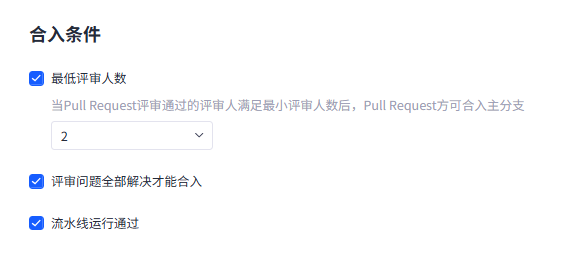

- **问题闭环**：检视发现的所有意见必须实质性解决，严禁未经确认直接标记为解决。

- **门禁校验**：合入前必须确保相关自动化流水线测试（CI）全部通过。

- **协议合规**：所有 PR 必须通过 CLA（贡献者许可协议）校验。

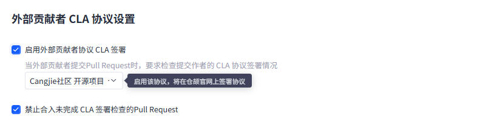

### **2.  合并策略限制**

- **合入限制**：严禁“自提自合”（即提交者与合入者为同一人），严禁强制合入。所有合并必须通过 Fork 方式进行。

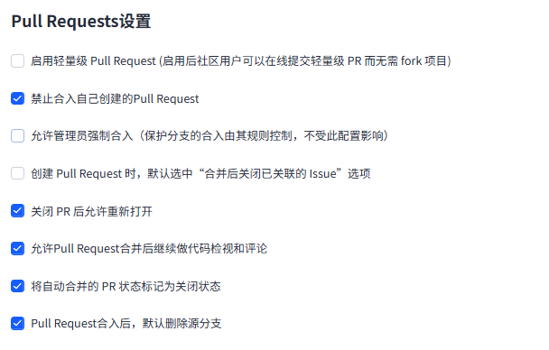

- **信息保留**：为保留项目原始提交脉络，原则上建议禁止 Squash 合并方式。

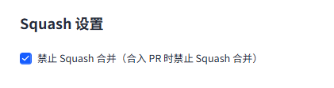

- **最小审查**：PR 最终必须由至少一名 Committer 审查通过后方可合入。

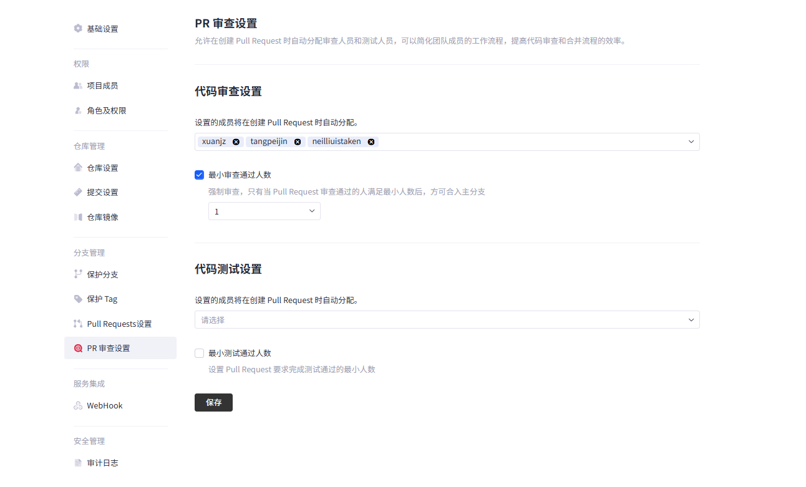
