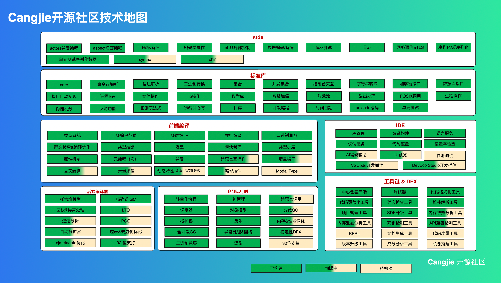
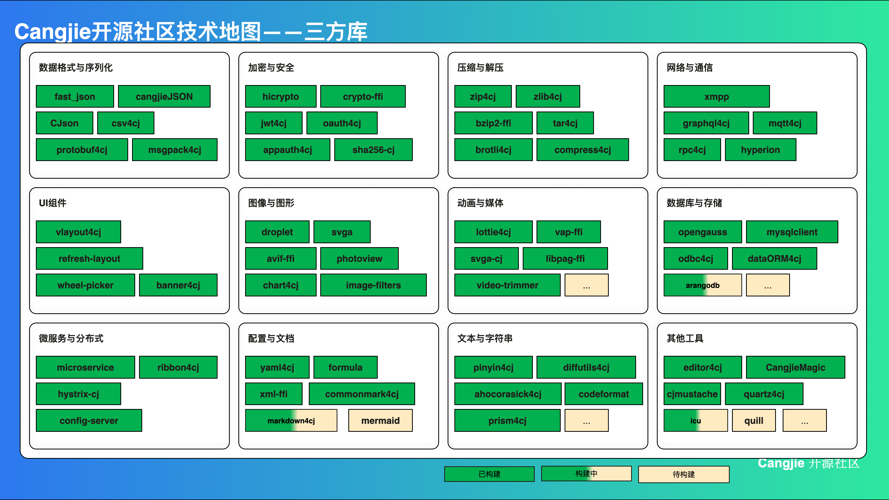

# Cangjie roadmap

| **Last modified on** | **July 2026**    |
| -------------------- | ---------------- |
| **Next update**      | **January 2027** |

欢迎来到 Cangjie 路线图！抢先了解 Cangjie 社区的优先事项。

## 关键优先事项

本路线图旨在为您提供整体概览。以下是我们重点关注的领域——我们致力于实现的最重要方向：

* **语言演进**：保持 Kotlin 的简洁性和表达力，优先考虑有意义的语义而非繁文缛节。

* **多平台**：通过稳健的 iOS 体验、成熟的 Web 目标和可靠的 IDE 工具，成为现代跨平台应用程序的基础。

* **保持平台无关性**：支持所有开发者，无论他们使用何种工具或目标平台。

* **生态系统支持**：简化 Kotlin 库、工具和框架的开发和发布流程。

## Cangjie 子系统路线图

如果您对路线图或其中的任何项目有任何疑问或反馈，请随时在本仓库反馈 Issue 或 发邮件至 tsc@cangjie-lang.net 。

