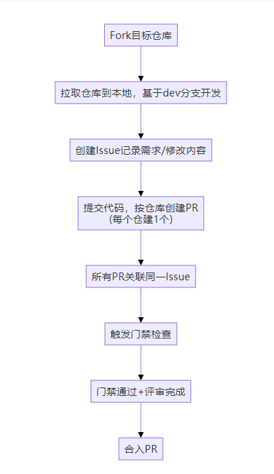
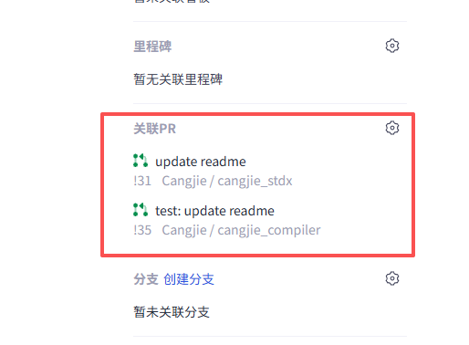
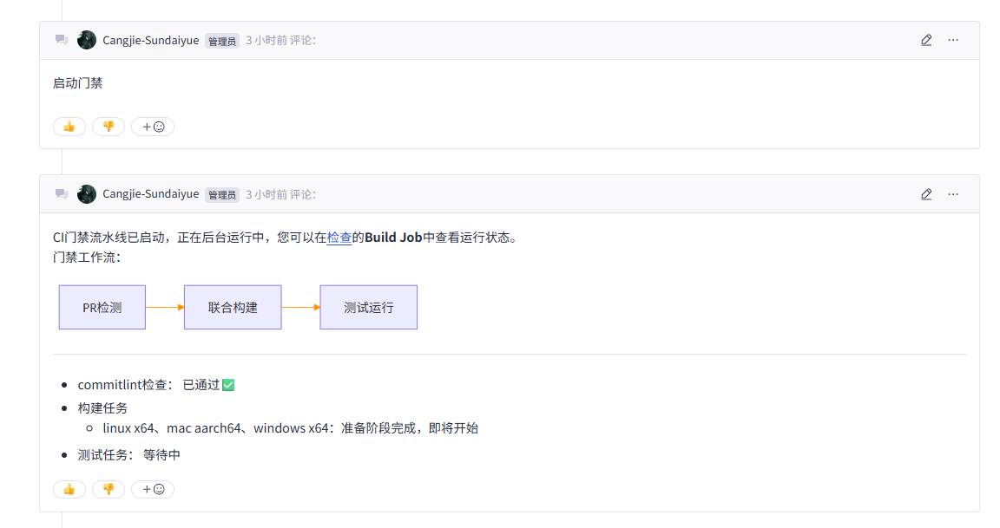
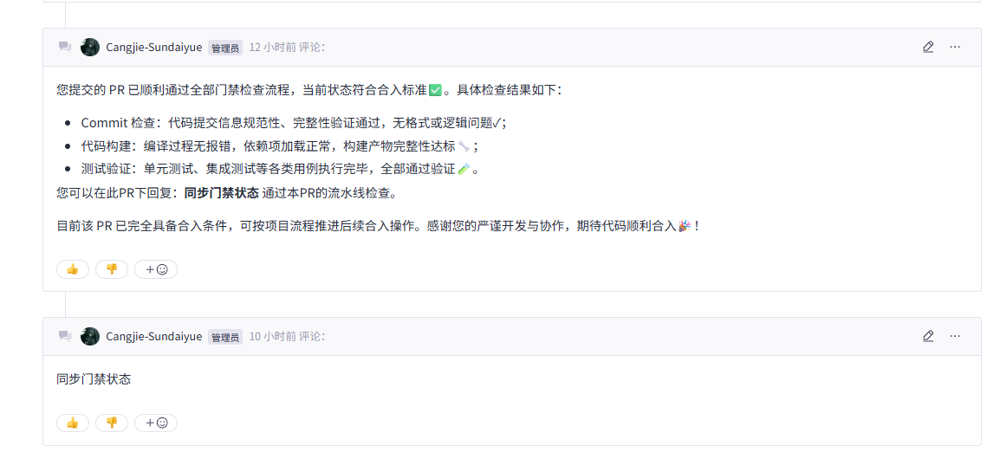
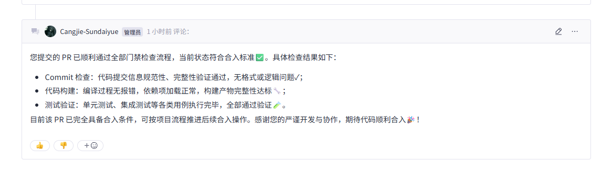
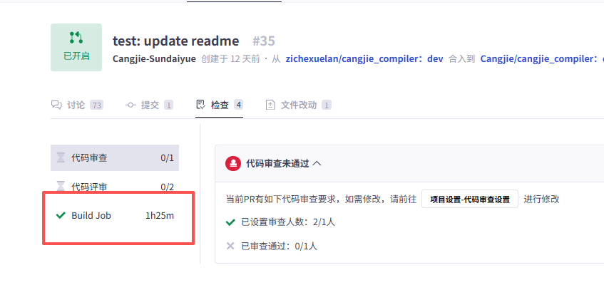

# 贡献流程<a name="ZH-CN_TOPIC_0000001052970939"></a>

## 环境准备<a name="section124971410183614"></a>

-   针对Git的安装、环境配置及使用方法，请参考GitCode帮助中心的Git知识大全：[https://docs.gitcode.com/docs/help/home/general-reference/git](https://docs.gitcode.com/docs/help/home/general-reference/git)
-   注册SSH公钥，请参考GitCode帮助中心的公钥管理：[https://docs.gitcode.com/docs/help/home/user_center/security_management/ssh](https://docs.gitcode.com/docs/help/home/user_center/security_management/ssh)
-   在开展GitCode的工作流之前，您需要先在Cangjie的代码托管平台上找到您感兴趣的Repository。

## 代码下载<a name="section6125202333611"></a>

### 从云上Fork代码分支<a name="section8365811818"></a>

1.  找到并打开对应Repository的首页。
2.  点击右上角的 Fork 按钮，按照指引，建立一个属于**个人**的云上Fork分支。

###  把Fork仓下载到本地<a name="section49051646201819"></a>

请按照以下的过程将Repository内的代码下载到您的在计算机上：

1.  **创建本地工作目录**：

    您需要创建本地工作目录，以便于本地代码的查找和管理

    ```
    mkdir ${your_working_dir}
    ```

2.  **复制远程仓库到本地**
    1.  **切换到本地路径**

        ```
        mkdir -p ${your_working_dir}
        cd ${your_working_dir}
        ```

    2.  **复制远程仓库到本地**
        -   您可以在仓库页面内复制远程仓库的拷贝地址，得到`$remote\_link`：

            **图 1**  复制远程仓库
            
            

        -   在本地电脑执行拷贝命令：

            ```
            git clone $remote_link
            ```

### 代码提交\(git clone场景\)<a name="section669715742719"></a>

1.  **拉分支**

    更新您的本地分支

    ```
    git remote add origin $remote_link
    git fetch origin
    git checkout master  
    git pull --rebase 
    ```

    基于远端master分支拉取本地调试分支

    ```
    git branch myfeature origin/master
    git checkout myfeature  
    ```

    然后在myfeature分支上编辑和修改代码。

2. **在本地工作目录提交变更**

   ```
   git add xxx
   git commit -sm  "feat: xxx"  // 提交信息包含signoff邮箱
   ```
   您可能会在前次提交的基础上，继续编辑构建并测试更多内容，可以使用commit --amend继续添加提交。
   提交信息采用 [Conventional Commits（约定式提交规范）](https://www.conventionalcommits.org/zh-hans/v1.0.0/)，一个复杂点的 commit 格式参考如下：
   ```
   feat: add some new features

   Add xx feature for xxx, it can xxxx.

   Add xx feature for xxx, it can xxxx.

   Refs: #12

   Assisted-by: Opencode
   Signed-off-by: xxx <xxx@xxx.com>
   ```
   
   更多 commit 风格信息参考[Conventional Commits（约定式提交规范）](https://www.conventionalcommits.org/zh-hans/v1.0.0/)。

   在仓颉社区的开源代码贡献规范中，如果您使用了 AI 工具辅助编写代码，须在 commit 末尾强制标注 `Assisted-by` 标签以明确 AI 的辅助贡献。格式如下：

   ```
   Assisted-by: <AI工具名称>   # 例如：Assisted-by: Opencode
   Signed-off-by: xxx <xxx@xxx.com>
   ```

   > **注意**：人类开发者必须对 AI 生成的每一行代码进行审查，确保其在功能、安全和许可证（License）合规上完全符合规范。若代码部署后出现漏洞或版权纠纷，最终责任由提供 `Signed-off-by` 的人类提交者承担。

3.  **将变更推送到您的远端目录**

    准备进行审查（或只是建立工作的异地备份）时，将分支推到您的fork仓库:

    ```
    git push -f origin myfeature
    ```

## Pull Request与门禁操作<a name="section28261522124316"></a>

### 完整流程概览



### 关键步骤说明

1. **基础准备**

- Fork 目标仓库，拉取至本地。
- 基于仓库dev分支开发，代码修改完成后提交到 Fork 仓。
- 仓库列表：
    - https://gitcode.com/Cangjie/cangjie_compiler    # 仓颉编译器仓库
    - https://gitcode.com/Cangjie/cangjie_runtime     # 仓颉运行时&标准库仓库
    - https://gitcode.com/Cangjie/cangjie_tools       # 仓颉工具链仓库
    - https://gitcode.com/Cangjie/cangjie_stdx        # 仓颉扩展库仓库
    - https://gitcode.com/Cangjie/llvm-project        # LLVM项目仓库（仓颉依赖）
    - https://gitcode.com/Cangjie/cangjie_test        # 仓颉测试用例仓库
    - https://gitcode.com/Cangjie/cangjie_test_framework  # 仓颉测试框架仓库

2. **Issue创建**

- 创建 Issue：在任意仓库创建 Issue 即可，请务必按照模板认真填写，必填项不要为空。

3. **PR创建**

- 创建 PR：
    - 单仓修改：从个人仓库分支向目标仓库 dev 分支创建 PR。
    - 多仓修改：为涉及的每个仓库分别创建 PR。
  
  - **重要提示**：
    - PR 都有模板，请务必按照模板认真填写，必填项不要为空。
    - 根据PR 模板中要求，在对应位置附上 Issue 链接可以自动关联 Issue，不需要再额外手动设置关联。
   
- **PR创建成功通知**：

    当您成功创建 Pull Request（PR）后，系统会自动回复以下通知信息：

    ```
    PR创建成功通知 | 感谢您的贡献 🎉
    
    您好！系统已检测到您成功创建 Pull Request（PR），感谢您对项目的支持与参与！以下几点需要您着重关注：
    
    一、PR必须关联Issue ❗
    
    触发门禁检查的必要步骤：在PR描述框输入Issue完整链接，完成Issue关联。
    
    请注意，一个 Issue 不能同时关联同一 base 仓库内的多个开启状态的 PR
    
    二、门禁触发规则 🔧
    
    门禁类型判定：由Issue关联的PR所属代码仓数量决定
    
    关联多个代码仓PR：触发「多仓联合门禁」
    
    关联单个代码仓PR：触发「单仓门禁」
    
    启动指令与检查范围：需主动回复指令：
    
    回复 "start build"：执行Cangjie的主要基础检查，包含commit格式检查、静态告警分析、多平台构建、测试等
    
    关联同一issue的多个PR，仅需在任意一个PR里回复触发一次门禁，该PR门禁通过后，所有PR都会添加Label和测试人
    
    每个pr只能同时运行一条CI流水线，如需重新启动，请先关闭运行中的，再评论触发门禁
    
    Markdown修改仅触发文档类构建测试门禁，不会触发Cangjie的编译测试门禁
    
    commit 信息格式请遵循：Conventional Commits 规范
    
    请保证每一条 commit 都已添加 Signed-Off-By 信息
    
    三、合入条件 ⚠️
    
    满足最低评审人数，且评审问题需全部解决；
    
    禁止合入本人创建的PR，需由其他协作者操作；
    
    合并前确保关联流水线任务运行成功（build-test-passed）。
    
    四、合并PR ✅
    
    回复 "start merge"，CI流水线会自动检查所有关联PR的状态，若所有PR都满足合并条件，则将会同时合并所有PR。若存在不满足合并条件的PR，则不会合并任何PR。
    
    五、补充说明 📢
    
    详细仓颉贡献流程：贡献流程(Cangjie Community Contribution)
    
    门禁结果将自动评论至关联的所有PR，敬请留意。
    ```

4. **PR关联操作**

- **关联方式**：
    - 在 PR 描述根据模板要求输入 Issue 完整链接，完成 Issue 关联（推荐方式，可自动关联）。
    
- **关联规则**：
    - 多仓修改时，多个仓的所有 PR 需关联同一个 Issue。
    - 请注意，一个 Issue 不能同时关联同一 base 仓库内的多个开启状态的 PR。

  

5. **门禁触发**

- **门禁类型判定**：
    - 由 Issue 关联的 PR 所属代码仓数量决定：
        - 关联多个代码仓 PR：触发「多仓联合门禁」
        - 关联单个代码仓 PR：触发「单仓门禁」
    - 多仓联合门禁：关联同一个 Issue 的 PR 会联合构建，如 cangjie_compiler、cangjie_runtime、cangjie_test 三个仓的三个 PR 关联了同一个 Issue，那么在运行门禁时，它们会进行联合构建和测试。
    
- **触发方式**：
    - 在任意关联 PR 的评论区回复指令：
        - 回复 "**start build**"：执行 Cangjie 的主要基础检查，包含 commit 格式检查、静态告警分析、多平台构建、测试等（推荐）
        - （内测中）回复 "**start full build**"：启动更全面的检查，耗时更长
    
      
    
- **触发规则**：
    - 关联同一 issue 的多个 PR，仅需在任意一个 PR 里回复触发一次门禁，该 PR 门禁通过后，所有 PR 都会添加 Label 和测试人。
    - 每个 PR 只能同时运行一条 CI 流水线，如需重新启动，请先关闭运行中的，再评论触发门禁。
    - 创建 PR、更新代码、重新打开 PR，系统**不会**自动触发门禁，需要重新回复触发 CI 门禁。
    - Markdown 修改仅触发文档类构建测试门禁，不会触发 Cangjie 的编译测试门禁。
    
      
    
- **门禁检查内容**：
    - Commit 格式检查（需遵循 Conventional Commits 规范）
    - 静态告警分析（Codecheck）
    - Linux/Windows/Mac 平台的构建和 HLT、LLT 测试
    - 请保证每一条 commit 都已添加 Signed-Off-By 信息

6. **PR检视**

- **检视要求**：
    - 满足最低评审人数要求，2个评审人，1个审查人以及必要的 codeowners 成员，codeowners成员和审查人设置为合并计数：如果 codeowners 中有 commtter 成员，则该成员通过后无需额外的审查人。
    - 评审问题需全部解决，评审问题无特殊情况外需要评论作者自行确认后解决，请勿代他人解决。
    - Committer 检视时除业务逻辑外必须关注以下内容：
        - PR 内容是否符合要求
        - Issue 内容是否完整
        - Commit log 内容是否规范
        - Commit 拆分是否合理
        - 版权信息是否符合要求

以上内容不符合要求时，不应该给予通过。为了检视效率，代码检视时建议优先选择 codeowner 成员，参考仓库中 .gitcode 文件夹下 CODEOWNERS 文件，其次优先同模块和本领域 committer 进行检视。

7. **PR合入**

- **合入条件**：
    - 所有关联 PR 的门禁检查结果为 "成功"（build-test-passed）。
    - 满足最低评审人数要求，且评审问题需全部解决。
    - 禁止合入本人创建的 PR，需由其他协作者操作。

- **合入方式**：
    - 回复 "**start merge**"，CI 流水线会自动检查所有关联 PR 的状态。
    - 若所有 PR 都满足合并条件，则将会同时合并所有 PR。
    - 若存在不满足合并条件的 PR，则不会合并任何 PR，并回复不满足条件的 PR。

​	


## 版本变化说明<a name="section_version_changelog"></a>

### 版本历史

本文档记录了仓颉社区贡献流程的版本更新历史，便于贡献者了解流程的变化。

---

#### 2026-06-22

**变更内容**：
- 新增 AI 辅助编码贡献规范：明确使用 AI 工具辅助编写代码时须在 commit 末尾标注 `Assisted-by` 标签，并强调人类开发者对 AI 生成代码的审查责任

---

#### 2025-12-29

**变更内容**：
- 明确 Issue 创建规则：补充说明不要重复创建多个相同 Issue，多个目标分支的 PR 可以同时使用一个 Issue 触发门禁
- 新增版本变化说明章节，用于记录文档和流程的重要变更历史

---

#### 2025-12-24

**变更内容**：
- 新增 sync 标签使用规则：明确从其他分支 cherry-pick 的同步改动需要关联 sync 标签
- 优化 PR Label 关联说明的结构和表述

---

#### 2025-12-23

**变更内容**：
- 完善 Issue 创建时的 Label 关联规则说明，明确缺陷类和需求类 Issue 的版本号 Label 关联要求
- 优化 PR 创建重要提示，要求变更内容描述信息充分详细，并提供必要的编译和自验证结果
- 简化门禁触发规则描述，移除冗余的门禁类型判定说明
- 优化 PR 关联规则表述，明确同一仓库内同一目标合入分支的限制

---

**注意**：版本变化说明将在此处持续更新，记录每次重要的流程变更和文档更新。
